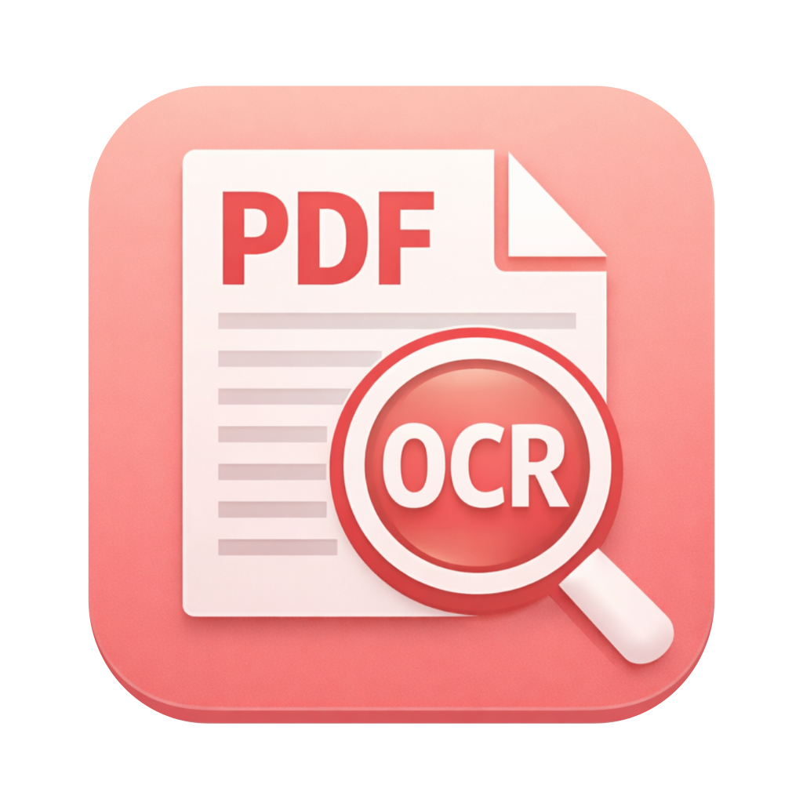
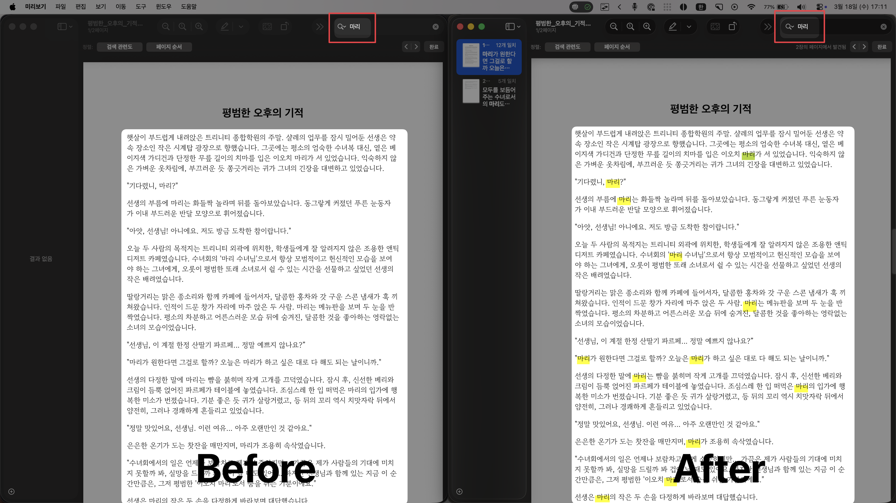
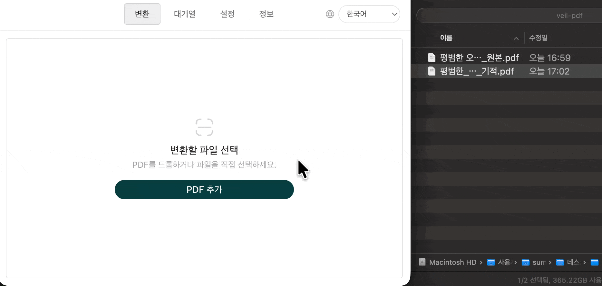
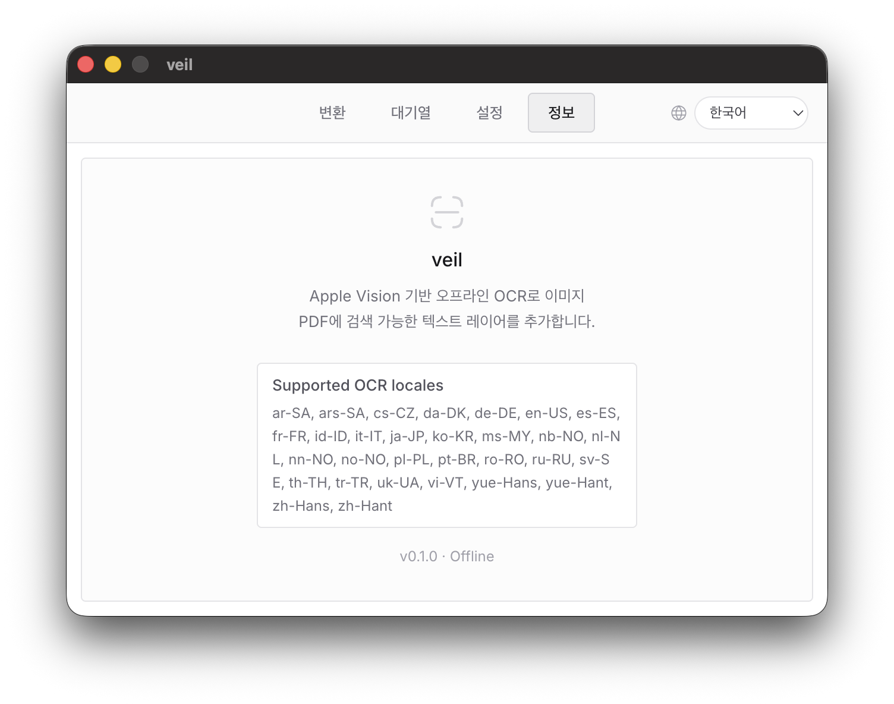

# veil

<p align="center">
  
</p>

<p align="center">
  
</p>

veil은 **macOS용 Electron 데스크톱 앱**입니다.  
이미지로만 구성된 PDF를 입력받아, 원본 페이지 모양은 유지한 채 **검색 가능한 텍스트 레이어를 추가한 searchable PDF**로 저장합니다.

이 앱은 Apple의 온디바이스 OCR 스택을 사용하며, 전체 처리는 **오프라인 로컬 환경**에서만 동작합니다.

## 이 앱이 하는 일

- 이미지 기반 스캔 PDF를 분석합니다.
- 각 페이지를 Apple Vision OCR로 인식합니다.
- 인식된 텍스트를 원본 PDF 위에 **보이지 않는 텍스트 레이어**로 삽입합니다.
- 결과 PDF를 macOS Preview에서:
  - 검색
  - 텍스트 선택
  - 복사
  할 수 있도록 만듭니다.

다음은 의도적으로 하지 않습니다.

- Tesseract 사용 안 함
- 클라우드 OCR 사용 안 함
- 온라인 API 사용 안 함
- 원본 페이지 이미지를 새로 다시 렌더링해서 바꾸지 않음

## 대상 기기와 환경

veil은 **Apple macOS가 설치된 Macintosh 컴퓨터**를 대상으로 합니다.

권장 환경:

- macOS 13 이상
- Apple Silicon Mac
  - M1, M2, M3, M4 계열

지원 목표 환경:

- Intel Mac
  - Electron과 네이티브 OCR 모듈이 정상적으로 빌드되는 경우 사용 가능

개발/빌드 환경:

- Node.js 22 LTS
- npm 10 이상
- Xcode Command Line Tools

주의:

- 이 프로젝트의 Apple OCR 브리지는 네이티브 모듈을 포함합니다.
- Apple Silicon Mac에서 Rosetta/x64로 잘못 설치되면 OCR worker가 시작 직후 종료될 수 있습니다.
- 이 경우 `npm run rebuild:native`로 다시 빌드해야 합니다.

## 기술 스택

- Electron
- React + TypeScript
- Vite
- shadcn/ui + Base UI
- Apple Vision OCR
- patched `@cherrystudio/mac-system-ocr`
- `pdfjs-dist`
- `pdf-lib`
- `electron-builder`
- `zod`

## 설치

Apple Silicon Mac에서 바로 설치하려면 아래 릴리스 파일을 다운로드하면 됩니다.

- Release page: [v0.1.0](https://github.com/yldst-dev/veil/releases/tag/v0.1.0)
- DMG: [veil-0.1.0-arm64.dmg](https://github.com/yldst-dev/veil/releases/download/v0.1.0/veil-0.1.0-arm64.dmg)
- ZIP: [veil-0.1.0-arm64-mac.zip](https://github.com/yldst-dev/veil/releases/download/v0.1.0/veil-0.1.0-arm64-mac.zip)

서명되지 않은 공개 빌드라 macOS에서 `손상되었기 때문에 열 수 없습니다` 경고가 뜰 수 있습니다.  
이 경우 `veil.app`을 `응용 프로그램` 폴더로 옮긴 뒤 아래 명령으로 quarantine 속성을 제거한 다음 다시 실행하세요.

```bash
xattr -dr com.apple.quarantine /Applications/veil.app
```

소스에서 직접 설치하고 실행하려면:

```bash
nvm use
npm install
```

네이티브 OCR 모듈 아키텍처가 맞지 않거나 OCR이 시작되지 않으면:

```bash
npm run rebuild:native
```

## 개발 실행

```bash
npm run dev
```

실행 항목:

- Vite renderer dev server
- Electron main / preload watch build
- Electron 앱 실행

## 빌드

```bash
npm run build
```

산출물:

- `dist/main`
- `dist/preload`
- `dist/renderer`

## macOS 앱 패키징

```bash
npm run pack:mac
```

예상 결과:

- `release/mac-arm64/veil.app`
- macOS용 패키지 산출물

앱 이름은 `Electron`이 아니라 **`veil`**로 패키징됩니다.

## 사용 방법

1. veil을 실행합니다.
2. PDF를 드래그 앤 드롭하거나 `PDF 추가`로 선택합니다.
3. 출력 폴더를 확인합니다.
4. `변환 시작`을 누릅니다.
5. 완료된 항목에서 결과 파일 또는 출력 위치를 엽니다.

<p align="center">
  
</p>

## 처리 대상과 상태

veil은 PDF를 다음처럼 처리합니다.

- image-only PDF
  - OCR 수행 후 searchable PDF 생성
- already-searchable PDF
  - 원본을 그대로 복사
- encrypted PDF
  - 실패 처리
- malformed PDF
  - 실패 처리

앱 상태:

- idle
- queued
- processing
- completed
- failed
- cancelled

## OCR 언어

veil은 앱 실행 시 **현재 macOS에서 Apple OCR이 실제로 지원하는 recognition locales 목록**을 조회합니다.

기본적으로는 다음 언어군을 우선 사용하도록 설계되어 있습니다.

- Korean
- English
- Japanese
- Chinese Simplified / Traditional

단, 실제 지원 목록은:

- macOS 버전
- Apple Vision 지원 범위
- 현재 시스템 OCR 구현

에 따라 달라질 수 있습니다.

정보 탭의 `Supported OCR locales`는 **앱이 시작될 때 현재 머신에서 자동 감지한 지원 목록**입니다.

<p align="center">
  
</p>

## 성능과 병렬 처리

veil은:

- 여러 PDF 파일을 동시에 처리할 수 있고
- 한 PDF 안의 여러 페이지도 병렬로 처리할 수 있습니다.

하지만 OCR과 PDF rasterization은 메모리 사용량이 큽니다.  
설정 탭에서 값을 과도하게 높이면 속도가 무조건 빨라지지 않고, 오히려 시스템이 불안정해질 수 있습니다.

현재 앱은 다음 요소를 기준으로 실제 실행 병렬도를 안전하게 조정합니다.

- 감지된 CPU 병렬도
- raster scale
- 전체 page budget

즉, UI에서 큰 값을 넣더라도 내부적으로는 더 안전한 값으로 낮춰 실행될 수 있습니다.

## 사용 시 주의점

### 1. 완전히 이미지인 PDF에 가장 적합합니다

veil은 이미지 스캔 PDF를 searchable PDF로 바꾸는 용도에 가장 적합합니다.

### 2. 결과 PDF의 화면상 모양은 거의 바뀌지 않아야 정상입니다

Visible page appearance는 유지되고, 텍스트 레이어만 보이지 않게 추가됩니다.

### 3. OCR 정확도는 원본 품질에 크게 영향받습니다

다음 경우 정확도가 떨어질 수 있습니다.

- 기울어진 스캔
- 흐린 문서
- 저해상도 문서
- 세로쓰기 / 복잡한 표 / 겹침이 많은 문서

### 4. Preview에서 최종 확인이 필요합니다

실제 결과는 macOS Preview에서 다음을 확인하는 것이 가장 중요합니다.

- 검색이 되는지
- 선택이 되는지
- 복사가 되는지

### 5. 병렬도를 너무 높이면 흰 화면 또는 renderer 불안정이 생길 수 있습니다

이 프로젝트는 안전 예산을 두고 동시성을 제한하지만, 매우 큰 문서와 높은 병렬 설정 조합에서는 여전히 시스템 리소스 부담이 커질 수 있습니다.

### 6. 네이티브 OCR 모듈은 Electron 런타임과 아키텍처가 맞아야 합니다

문제가 생기면 먼저 아래를 실행하세요.

```bash
npm run rebuild:native
```

## 테스트

```bash
npm test
```

현재 자동 테스트 범위:

- OCR 결과 정규화
- OCR 좌표에서 PDF 좌표로의 변환
- searchable PDF text-layer 삽입 후 텍스트 추출 검증

## 프로젝트 구조

```text
src/
  components/
  hooks/
  lib/
    ui/
  main/
  preload/
  renderer/
  services/
    files/
    ocr/
    pdf/
  shared/
```

## 라이선스

이 프로젝트는 **`GPL-3.0`** 라이선스를 따릅니다.
